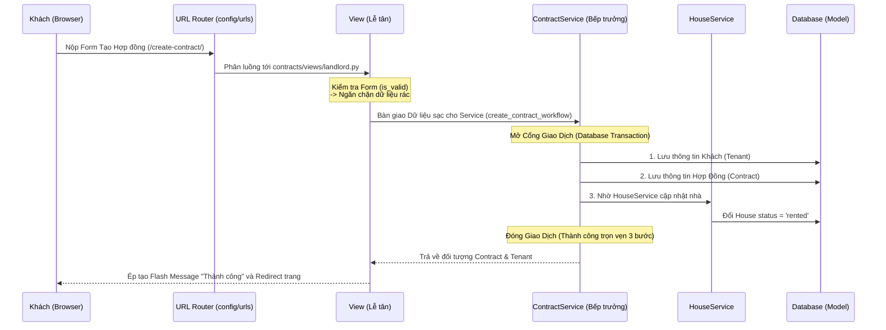

# LT-GIS: Hệ thống Quản lý Đăng tin Phòng trọ (WebGIS)

Dự án ứng dụng công nghệ WebGIS trong việc quản lý, tìm kiếm và đăng tin phòng trọ trên địa bàn TP.HCM.

---

## Cấu trúc thư mục

```text
GIS-WEB-HOUSE-RENTAL-MANAGEMENTMENT/
├── docker-compose.yml          # Cấu hình Docker Compose (web + PostgreSQL)
├── Dockerfile                  # Build image cho Django app
├── requirements.txt            # Danh sách thư viện Python
├── media/                      # Thư mục chứa file upload (ảnh nhà, CCCD, hợp đồng...)
├── README.md
│
└── website/                    # ── Django Project Root ──
    ├── manage.py               # Entry point (DJANGO_SETTINGS_MODULE = config.settings)
    │
    ├── config/                 # Cấu hình trung tâm của project
    │   ├── settings.py         #   Cài đặt Django (DB, apps, middleware...)
    │   ├── urls.py             #   Bảng định tuyến gốc — phân luồng URL tới từng app
    │   ├── wsgi.py             #   WSGI entry point (cho deploy production)
    │   └── asgi.py             #   ASGI entry point (cho deploy async)
    │
    ├── accounts/               # App: Tài khoản & Xác thực
    │   ├── models.py           #   Profile (1-1 với User)
    │   ├── views/              #   [Thư mục] Đăng ký, xem hồ sơ (auth.py, profile.py)
    │   ├── urls/               #   [Thư mục] /auth/login, /auth/register, /auth/profile
    │   └── admin.py            #   Đăng ký ProfileAdmin
    │
    ├── houses/                 # App: Quản lý Nhà cho thuê (Core Domain)
    │   ├── models.py           #   House, Furniture, HouseImage
    │   ├── views/              #   [Thư mục] Gồm public.py (khách vãng lai) và landlord.py (chủ nhà)
    │   ├── urls/               #   [Thư mục] Bảng định tuyến được chia theo user type
    │   ├── forms.py            #   HouseForm (form đăng tin)
    │   ├── admin.py            #   HouseAdmin + custom filter/actions (duyệt, từ chối)
    │   ├── services/           #   Tầng Business Logic (tách khỏi views)
    │   │   ├── house_service.py    # Tìm kiếm bán kính (Haversine), tìm kiếm vùng vẽ (Shapely)
    │   │   └── geocoding.py        # Chuyển địa chỉ → tọa độ (Nominatim API)
    │   └── api/                #   REST API (DRF) cho bản đồ
    │       ├── views.py        #     API tìm nhà theo bán kính, theo polygon vẽ
    │       ├── serializers.py  #     HouseSerializer (chuyển đổi Model → JSON)
    │       └── urls.py         #     /api/v1/houses/, /api/v1/polygon-search/
    │
    ├── contracts/              # App: Quản lý Hợp đồng & Khách thuê
    │   ├── models.py           #   Tenant (khách thuê), Contract (hợp đồng)
    │   ├── views/              #   [Thư mục] Chứa landlord.py xử lý hợp đồng, khách thuê
    │   ├── urls/               #   [Thư mục] Định tuyến tạo/xem hợp đồng
    │   ├── forms.py            #   TenantForm, ContractForm
    │   └── admin.py            #   TenantAdmin, ContractAdmin
    │
    ├── custom_admin/           # App: Trang Quản trị Tùy chỉnh (thay thế Django Admin)
    │   ├── views/              #   [Thư mục] Tách nhỏ 400 dòng thành: auth, users, houses, contracts, furnitures
    │   ├── urls/               #   [Thư mục] Tách nhỏ các route theo từng phân hệ
    │   └── forms.py            #   AdminUserCreateForm, AdminHouseForm, AdminFurnitureForm
    │
    ├── templates/              # Templates tập trung (HTML — xử lý phía server)
    │   ├── layouts/            #   Base templates dùng chung (base.html, dashboard_base.html)
    │   ├── home.html           #   Trang chủ
    │   ├── accounts/           #   Templates cho accounts (login, register, profile)
    │   ├── houses/             #   Templates cho houses (chi tiết nhà, bản đồ)
    │   ├── dashboard/          #   Templates cho dashboard người dùng
    │   └── custom_admin/       #   Templates cho trang quản trị
    │
    └── static/                 # Tài nguyên tĩnh (CSS, JS, Fonts, Images — gửi thẳng xuống trình duyệt)
        ├── css/
        ├── fonts/
        └── images/
```

---

## Giải thích kiến trúc: Tại sao cấu trúc như thế này?

### 1. Tại sao tách ra nhiều App thay vì để một chỗ?

Django khuyến khích mỗi app chỉ đảm nhận **một nhóm nghiệp vụ** (Single Responsibility). Nếu để tất cả model, view, form vào một app duy nhất, khi project phát triển sẽ:

- File `views.py` phình lên hàng nghìn dòng, rất khó tìm code
- Nhiều người cùng sửa một file → xung đột Git liên tục
- Không thể hiểu nhanh phạm vi ảnh hưởng khi thay đổi code

Cách chia hiện tại:

| App | Nghiệp vụ | Lý do tách riêng |
|-----|-----------|-------------------|
| `accounts` | Đăng nhập, đăng ký, hồ sơ | Auth là tính năng độc lập, hầu như không thay đổi khi phát triển thêm |
| `houses` | Nhà cho thuê, bản đồ, API | Core domain — phần lớn logic nghiệp vụ nằm ở đây |
| `contracts` | Hợp đồng, khách thuê | Có model riêng (Tenant, Contract), flow nghiệp vụ riêng (tạo HĐ → đổi trạng thái nhà) |
| `custom_admin` | Trang quản trị | Admin có giao diện, quyền, flow hoàn toàn khác với user thường |

### 2. Tại sao `config/` thay vì dùng tên project mặc định?

Khi chạy `django-admin startproject`, Django tạo folder cùng tên project (ví dụ: `GIS_WEB_HOUSE_RENTAL_MANAGEMENTMENT/settings.py`). Tên quá dài, khó gõ mỗi lần import.

Đổi thành `config/` giúp:
- Ngắn gọn, dễ nhớ: `config.settings`, `config.urls`
- Convention phổ biến trong cộng đồng Django
- Thể hiện rõ mục đích: đây là folder **cấu hình**, không chứa logic nghiệp vụ

### 3. Kiến trúc Enterprise MVC (Có thêm tầng Service)

Tại sao không đẩy thẳng toàn bộ nghiệp vụ (lưu Form, kiểm tra tọa độ, gán trạng thái, v.v) vào file `views.py` như truyền thống mà lại sinh ra thư mục `services/`?

Câu trả lời nằm ở khái niệm thiết kế phần mềm cốt lõi: **Actor-Driven (Hướng Tác nhân) vs Domain-Driven (Hướng Thực thể)**.

- **Thư mục Views là "Người Gác Cửa" (Actor-Driven):** Nó bắt buộc phải chia theo vai trò người dùng (`public.py`, `landlord.py`, `custom_admin`). Nhiệm vụ của View chỉ là Nhận Yêu Cầu (Request) -> Nhờ vả ai đó làm -> Báo kết quả (Response). View tuyệt đối KHÔNG chứa các câu lệnh `if/else` để lưu dữ liệu phức tạp. Điều này giúp ngăn chặn tình trạng "Fat Controller" (Bộ điều khiển béo phì).
- **Thư mục Services là "Bếp Trưởng" (Domain-Driven):** Nó chia theo các thực thể CSDL cốt lõi (`house_service.py`, `contract_service.py`). Nó không quan tâm ai là người gọi nó (Chủ nhà gọi, hay Admin gọi, hay Thằng lập trình viên test code gọi). Nhiệm vụ của nó là thực thi chính xác thuật toán cốt lõi.

**Lợi ích khổng lồ:**
Nếu sau này hệ thống viết thêm API cho Mobile App, thì cái `api/views.py` chỉ việc gọi lại nguyên xi hàm `HouseService.process_coordinate_status()`. Điểm 10 cho khả năng tái sử dụng (DRY - Don't Repeat Yourself)! Cả hệ thống Web HTML và Mobile App sẽ xài chung logic mà không lo bị lệch pha.

### 4. Tại sao API nằm trong `houses/api/` thay vì app riêng hay nhét vào thư mục `views/`?

API bản chất là **một cách phục vụ dữ liệu** (trả JSON thay vì HTML). Nó không phải một domain nghiệp vụ riêng, nhưng nó lại cần một hệ sinh thái riêng biệt.

```text
houses/
├── views/        → Dành trọn vẹn cho giao diện Web (Render HTML, dùng Forms)
├── api/          → Thế giới thu nhỏ của API (JSON, dùng Serializers)
│   ├── views.py
│   ├── serializers.py
│   └── urls.py
└── services/     → Chứa logic nghiệp vụ dùng chung cho cả 2 bên (Ví dụ: Geocoding)
```

**Tại sao KHÔNG tách `api` thành app riêng?**
- Nếu tạo app `api`, nó sẽ phải import model `House` từ `houses` → phụ thuộc chéo nặng nề.
- Nếu sau này `contracts` cũng cần API → lại phải nhét vào app `api` đó? Rất nhanh chóng app `api` sẽ biến thành một "Bãi rác" chứa API của toàn hệ thống mà không có ranh giới nghiệp vụ (Domain boundary) rõ ràng.

**Tại sao KHÔNG nhét API vào thư mục `views/`? (Dù bản chất nó vẫn là View)**
Đúng là API View vẫn kế thừa từ View của Django. Thế nhưng, nếu bạn tạo file `houses/views/api.py` thì sẽ cực kỳ lấn cấn khi giải quyết câu hỏi: **Vậy file `serializers.py` và đường dẫn tĩnh `/api/v1/` vứt ở đâu?**
- Nếu ném `serializers.py` ra ngoài rễ thư mục `houses/`, nó sẽ lạc quẻ vì code Web không hề dùng tới nó.
- Việc tạo hẳn một phân hệ `api/` giúp "gói ghém" trọng vẹn hệ sinh thái của DRF (gồm URLs, Views, Serializers) vào chung một chỗ. Không giẫm đạp lên code Web HTML, và cực kỳ dễ gỡ bỏ (Plug & Play) nếu sau này dự án không cần API nữa.

### 5. Tại sao Templates tập trung (`templates/`) thay vì mỗi app một folder?

Django hỗ trợ cả hai cách:
- **Cách 1**: `templates/` tập trung ở ngoài rễ dự án.
- **Cách 2**: Để tản mác trong từng app (`accounts/templates/accounts/`, `houses/templates/houses/`...)

**Dự án quyết định chọn Cách 1 vì:**
Khác với Backend (mạnh ai nấy lo), bộ mặt Frontend là một khối dính liền. Nếu chia nhỏ template vào từng app, Kỹ sư Frontend sẽ phải đào bới 10 thư mục Python chỉ để sửa giao diện. Gom chung lại giúp:
- Quản lý tập trung các layout dùng chung (`base.html`, `dashboard_base.html`).
- Frontend Dev chỉ cần làm việc trong đúng 2 gốc là `templates/` và `static/`.
- Dễ dàng Ghi đè (Override) giao diện của các thư viện bên thứ 3 (như `allauth`).

**Hỏi thêm: Tại sao file Bản đồ (`map_static.html`) lại nằm trong `templates/houses/` mà không tách ra thư mục `maps/` riêng?**
Bởi vì ở giai đoạn hiện tại, bản đồ sinh ra với mục đích duy nhất là **Hiển thị Vị trí Nhà trọ**. Nó đóng vai trò là một "Giao diện trực quan" của bảng dữ liệu `House`. Do đó, đặt nó ở `houses/` là chuẩn xác theo Domain-Driven Design. (Trừ khi sau này Bản đồ thăng cấp thành "Siêu bản đồ" hiển thị cả Trạm xe buýt, Quy hoạch thành phố... thì lúc đó mới xứng đáng tách ra thư mục `maps/` độc lập).

### 6. Tại sao `static/` và `templates/` ngang hàng, không lồng nhau?

Hai loại tài nguyên này phục vụ mục đích hoàn toàn khác:

| | `templates/` | `static/` |
|---|---|---|
| **Xử lý bởi** | Django template engine (server) | Trình duyệt tải trực tiếp (client) |
| **Nội dung** | HTML với biến, if/for, extends | CSS, JS, hình ảnh, fonts |
| **Khi deploy** | Django render ra HTML rồi gửi | Nginx/CDN phục vụ trực tiếp, không qua Django |

Để ngang hàng là **chuẩn Django convention**, tách rõ trách nhiệm server vs client.

### 7. Tại sao `media/` nằm ngoài `website/`?

`media/` chứa file do người dùng upload (ảnh nhà, CCCD, hợp đồng...). Đặt ngoài `website/` vì:
- **Không thuộc source code** — không nên commit vào Git
- **Khi deploy**, media thường lưu trên storage riêng (S3, CDN)
- Docker volume mount riêng, không ảnh hưởng khi rebuild container

### 8. Tại sao tách `custom_admin` thay vì gộp logic quản trị vào từng App con?

Một lựa chọn kiến trúc khác là phân bổ logic quản trị vào từng app riêng lẻ (ví dụ: `houses/admin_views.py`). Dù cách này đảm bảo tính đóng gói tốt (Domain-Driven Design), dự án vẫn quyết định gom tất cả giao diện quản trị vào một App trung tâm `custom_admin` vì 3 lý do cốt lõi:

- **Tính liên thông dữ liệu (Cross-Domain)**: Trang Dashboard thường cần vẽ biểu đồ và thống kê chéo nhiều bảng dữ liệu. Ví dụ: *Biểu đồ tỉ lệ Hợp đồng (`contracts`) thực tế theo từng khu vực Nhà trọ (`houses`)*. Đặt logic đa chiều này ở `custom_admin` đảm bảo tính trung lập, tránh việc một app phải gánh trách nhiệm của app khác.
- **Thống nhất Giao diện (Layout & Assets)**: Hệ thống quản trị nội bộ sử dụng một bộ khung Layout riêng rất phức tạp (Sidebar điều hướng chung, Chart.js, DataTables). Một app trung tâm giúp gom gọn toàn bộ cấu hình Template và CSS/JS thay vì bắt các app con chia nhau xử lý.
- **Màng lọc bảo mật (Security Choke Point)**: Mọi đường dẫn quản trị đều quy về một mạch máu duy nhất (ví dụ `/custom-admin/...`). Cấu trúc này giúp lập trình viên có thể đặt bức tường lửa chặn người dùng ngay từ URL tổng thông qua Route Grouping hoặc Middleware cực kỳ an toàn; triệt tiêu hoàn toàn rủi ro bị "lọt lưới" bảo mật do quên cấu hình phân quyền như khi code rải rác từng app.

### 9. Tại sao lại "đập" file `views.py` và `urls.py` thành các thư mục `views/` và `urls/`?

Dự án áp dụng mô hình **Directory-based Views & URLs** cho TẤT CẢ các apps (kể cả app nhỏ như `accounts` hay app khổng lồ như `custom_admin`). Thay vì chỉ có 1 file `views.py` chứa tất cả, chúng ta tạo ra thư mục `views/` và tách nhỏ code thành `auth.py`, `public.py`, `landlord.py`... 

Quyết định kiến trúc này nhằm giải quyết 3 bài toán:

- **Tính nhất quán tuyệt đối (Absolute Uniformity)**: Bất kể dev nhảy vào app nào, họ cũng thấy cùng một format. Không có chuyện "app nhỏ thì 1 file, app to thì 1 thư mục". Sự đồng bộ này giảm thiểu triệt để chi phí "chuyển đổi luồng suy nghĩ" (context-switching cost) khi làm việc.
- **Code tự giải thích (Self-Documenting Code)**: Dev mới nhìn vào thư mục `houses/views/` là biết ngay app này phục vụ 2 đối tượng `public` và `landlord` mà không cần đọc bất kỳ dòng code logic nào. Tên file đã nói lên tất cả.
- **Tuân thủ xuất sắc MVC & SOLID**: MVC quy định "View (Controller trong Django)" có nhiệm vụ điều phối. Nhưng nếu bạn nhét 50 chức năng chọc Database khác nhau vào cùng 1 file, bạn đang vi phạm nguyên tắc S (Single Responsibility) trong SOLID. Việc chia thư mục giúp các "Nhạc trưởng" chỉ huy đúng sân khấu của mình (Auth quản lý đăng nhập, Landlord quản lý đăng bài), vừa chuẩn MVC, vừa sạch sẽ theo SOLID. Cuối cùng, ở file root `config/urls.py`, chúng ta điều hướng tập trung trực tiếp vào các file route con này, giúp bức tranh luồng đi của dự án hiện ra vô cùng minh bạch.

---

## Luồng Xử lý Dữ liệu Chuyên sâu (Data Flow với Service Layer)

Để hình dung hệ thống chạy như thế nào với kiến trúc MVC + Service, hãy xem xét luồng giao dịch **"Tạo Hợp đồng thuê nhà"** (Create Contract):



**Diễn giải theo ẩn dụ Nhà Hàng:**
1. Khách hàng nộp Order List cho Gác cửa.
2. Bộ định tuyến (URL) thấy khách mặc đồ Landlord bèn chỉ đường tới Lễ tân khu vực Chủ nhà (`contracts/views/landlord.py`).
3. Lễ tân (View) dòm lướt qua cái Order thấy Form hợp lệ (is_valid), bèn chạy vào trong bếp tìm Bếp Trưởng Hợp Đồng (`contract_service.py`). Lễ tân KHÔNG BAO GIỜ tự tay xào nấu dữ liệu.
4. Bếp Trưởng (Service) kích hoạt `atomic transaction` (Đảm bảo nấu xong món ăn trọn vẹn, nếu giữa tiến trình cúp điện thì đổ bỏ hết làm lại từ đầu chứ không bưng ra món ăn sống).
5. Bếp Trưởng lưu Khách Thuê -> Lưu Hợp Đồng -> Rồi hô gào qua khu bếp kế bên nhờ lão Bếp Trưởng Nhà (`house_service.py`) đổi cái biển báo của Căn nhà đó thành "Đã thuê". (Đây là lý do tại sao các Service gọi nhau, tính đóng gói cực cao).
6. Nấu xong xuôi, Bếp báo cho Lễ tân. Lễ tân bưng đồ ăn (Flash Message) ra tươi cười với Khách và lật menu sang trang mới (Redirect).

---

## Yêu cầu

1. Docker Desktop
2. Git
3. (Tùy chọn) Python 3.11+ nếu chạy local không dùng Docker

## Chạy dự án bằng Docker

Tất cả lệnh bên dưới chạy tại thư mục gốc dự án (nơi có `docker-compose.yml`).

### 1. Clone source

```bash
git clone <repo-url>
cd GIS-WEB-HOUSE-RENTAL-MANAGEMENTMENT
```

### 2. Build và khởi động container

```bash
docker compose up --build -d
```

### 3. Migrate database

```bash
docker compose exec web python website/manage.py migrate
```

### 4. Tạo tài khoản admin

```bash
docker compose exec web python website/manage.py createsuperuser
```

### 5. Truy cập

| Trang | URL |
|-------|-----|
| Trang chủ | http://127.0.0.1:8000/ |
| Bản đồ | http://127.0.0.1:8000/map/ |
| Django Admin | http://127.0.0.1:8000/admin/ |
| Custom Admin | http://127.0.0.1:8000/custom-admin/ |
| API tìm nhà | http://127.0.0.1:8000/api/v1/houses/?lat=10.78&lng=106.70&radius=5 |

### 6. Lệnh hay dùng

```bash
# Xem trạng thái container
docker compose ps

# Xem log web
docker compose logs -f web

# Dừng hệ thống
docker compose down
```

## Lưu ý về dữ liệu khi làm nhóm

Dữ liệu PostgreSQL lưu trong Docker volume (`postgres_data`), không nằm trong Git. Thành viên mới clone code sẽ **không** tự động có data.

### Cách 1: Chia sẻ bản sao database

Tại máy đang có dữ liệu:

```bash
docker compose exec -T db pg_dump -U postgres -d quanlythuenha > backup.sql
```

Gửi `backup.sql` cho thành viên khác:

```bash
docker compose up -d db
docker compose exec -T db psql -U postgres -d quanlythuenha < backup.sql
```

### Cách 2: Dùng fixture (dữ liệu mẫu)

Xuất:

```bash
docker compose exec web python website/manage.py dumpdata --indent 2 > seed_data.json
```

Nhập tại máy mới:

```bash
docker compose up -d
docker compose exec web python website/manage.py migrate
docker compose exec web python website/manage.py loaddata seed_data.json
```

## Chạy local không dùng Docker

```bash
python -m venv .venv
.venv\Scripts\activate
pip install -r requirements.txt
python website/manage.py migrate
python website/manage.py runserver
```

> Lưu ý: Cần có PostgreSQL local và cấu hình biến môi trường kết nối DB.

## Quy trình làm việc nhóm với Git

Không code trực tiếp trên nhánh `dev`.

```bash
# Cập nhật dev
git checkout dev
git pull origin dev

# Tạo nhánh tính năng
git checkout -b feature/ten-tinh-nang

# Làm việc và đẩy code
git add .
git commit -m "feat: mô tả ngắn gọn"
git push -u origin feature/ten-tinh-nang
```

Tạo Pull Request để merge vào `dev` sau khi được review.
